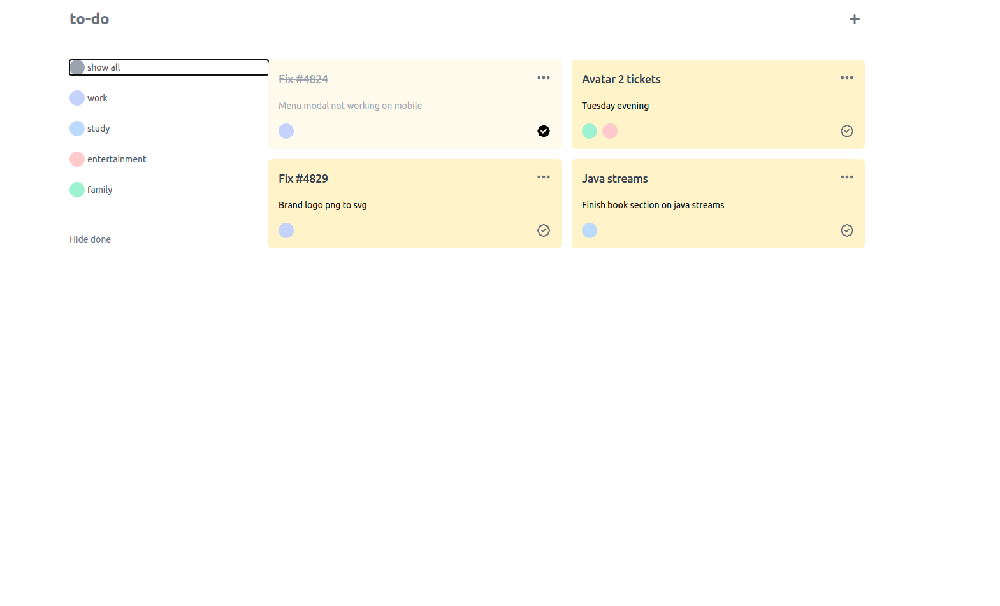
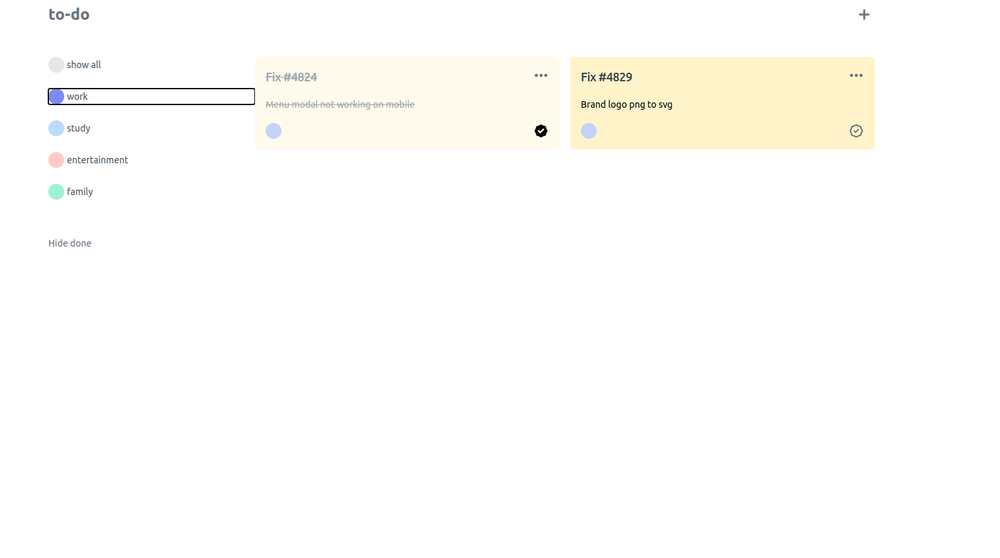
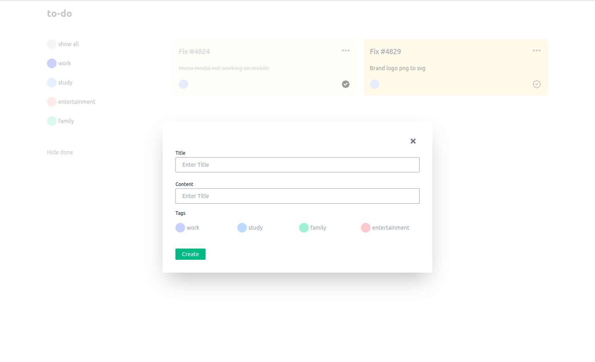

# Vue3 to-do app with Composition API

- :heavy_check_mark: User can create to-do
- :heavy_check_mark: User can mark to-to done
- :heavy_check_mark: User can filter to-do by category, done status
- :heavy_check_mark: User can delete to-to
- :heavy_check_mark: User can edit to-do

## Stack

- Vue 3
- Tailwind CSS

---

## Usage

```bash
# clone repository
git clone https://github.com/EvaldasBurlingis/vue3-todo.git

# move to directory
cd vue3-todo

# install dependencies
npm install

# serve website
npm serve
```

---

## Screenshots

<div>
	
    <br/>
    <br/>
	
    <br/>
    <br/>
    
</div>
